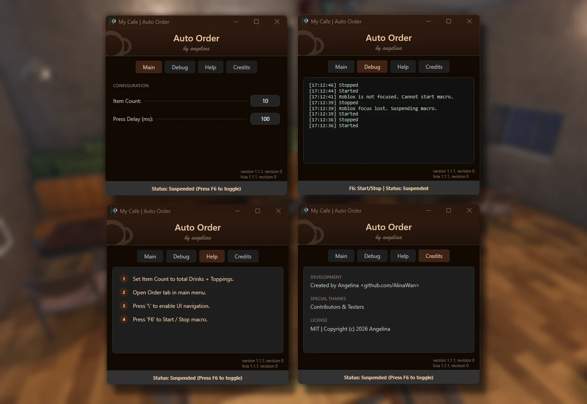

<div align="center">
  <h1>Livia</h1>
  <p><i>"Magnus ab integro saeclorum nascitur ordo" —Virgil, Eclogue IV (c. 40 BCE)</i></p>

[](LICENSE)
[](#)
[](#)
[](#)

An open-source library for building Roblox automation macros in C#,
with a collection of prebuilt macros built on its API.



</div>

## Prerequisites

* [.NET 10 SDK](https://dotnet.microsoft.com/en-us/download/dotnet/10.0)
* Windows 11 or later

## Build Your Own Macro

Livia can be added to an existing console application project by adding the package from NuGet:
```powershell
dotnet add package Livia
```

## API

Livia provides an easy-to-use API for creating automation macros. The following list is not exhaustive, but it covers the most commonly used APIs.

See [Livia Guides](GUIDES.md) for practical examples demonstrating how Livia's APIs can be used to implement common functionality in an application, including detecting Roblox disconnects and implementing auto-rejoin.

### UI

<details>
  <summary>Click to expand</summary>

| API                                    | Description                                        |
| :------------------------------------- | -------------------------------------------------- |
| `CommonTab.Create(...)`                | Creates a new tab in the UI.                       |
| `CommonIntegerInput.CreateRow(...)`    | Creates a new row with an integer input box.       |
| `CommonStringInput.CreateRow(...)`     | Creates a new row with a string input box.         |
| `CommonToggle.CreateRow(...)`          | Creates a new row with a toggle switch.            |
| `CommonSegmentedToggle.CreateRow(...)` | Creates a new row with a segmented toggle switch.  |
| `CommonHelpStep.Create(...)`           | Creates a new help step with a number and content. |

</details>

### Input Simulation

<details>
  <summary>Click to expand</summary>

| API                                              | Description                                                            |
| :----------------------------------------------- | ---------------------------------------------------------------------- |
| `Mouse.MoveMouseToPositionOnVirtualDesktop(...)` | Moves the mouse to a specific position on the virtual desktop.         |
| `Mouse.MoveMouseBy(...)`                         | Moves the mouse by a specified offset.                                 |
| `Mouse.VerticalScroll(...)`                      | Scrolls the mouse wheel vertically by a multiple of wheel delta.       |
| `Mouse.LeftClick(...)`                           | Simulates a left mouse click.                                          |
| `Mouse.RightClick(...)`                          | Simulates a right mouse click.                                         |
| `Keyboard.KeyDown(...)`                          | Simulates a key press down event.                                      |
| `Keyboard.KeyUp(...)`                            | Simulates a key release event.                                         |
| `Keyboard.KeyPress(...)`                         | Simulates a key press and release event.                               |
| `VirtualKeys`                                    | An enumeration of key names and their corresponding virtual key codes. |

</details>

### Services

<details>
  <summary>Click to expand</summary>

| API                  | Description                                                                   |
| :------------------- | ----------------------------------------------------------------------------- |
| `WindowFocusMonitor` | Monitors a process by executable name and raises an event on focus change.    |
| `RobloxLogMonitor`   | Monitors a Roblox log file by a regex pattern and invokes callbacks on match. |

</details>

### Utilities

<details>
  <summary>Click to expand</summary>

| API                                     | Description                                                                      |
| :-------------------------------------- | -------------------------------------------------------------------------------- |
| WindowUtils.ForceFocusWindow(...)       | Forces the target application window to the foreground and brings it into focus. |
| SystemUtils.InitiateSystemShutdown(...) | Requests a system shutdown with a specified timeout and display message.         |
| SystemUtils.AbortSystemShutdown(...)    | Aborts a previously scheduled system shutdown request.                           |

</details>

## Prebuilt Macros

The official Livia macros can be used as references for building your own macros. You can find them in the `Apps` folder of this repository.

Run any official Livia macro project directly using the .NET CLI:

```powershell
dotnet run --project Apps/<Experience>/<Macro>
```

### Livia Reference Macros

<div align="center">

| Experience                                              | Available Macros                     |
| :------------------------------------------------------ | :----------------------------------- |
| [My Cafe](https://www.roblox.com/games/133345376331809) | [Auto Order](Apps/MyCafe/AutoOrder/) |
| more coming soon™                                       |                                      |

</div>

---

<div align="center">
Made with ❤️ in Visual Studio
</div>