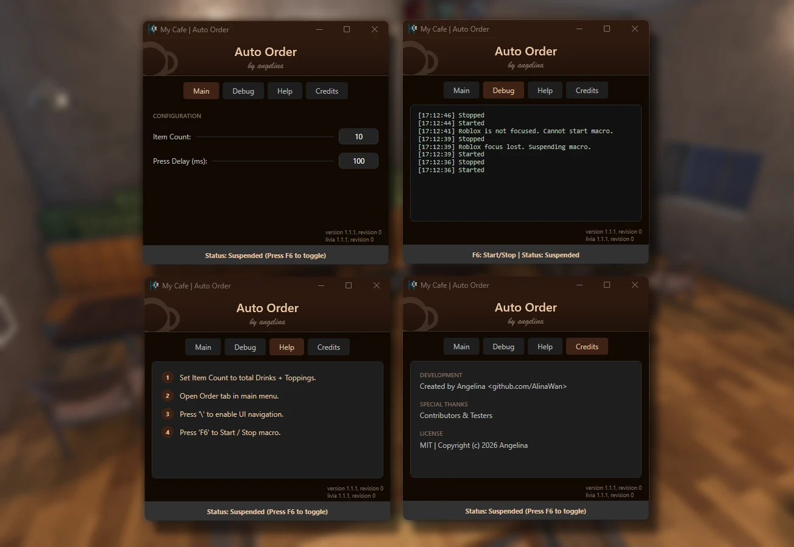

<div align="center">
  <h1>Livia</h1>
  <p><b>A New Frontier in Macro Development</b></p>

[](LICENSE)
[](#)
[](#)
[](#)
[](#)

An avant-garde open-source C# automation framework and engine that brings reusable, extensible software architecture to Roblox macros, challenging the status quo of building automation as isolated, one-off scripts.

<sub>*"Magnus ab integro saeclorum nascitur ordo" —Virgil, Eclogue IV (c. 40 BCE)*</sub>



</div>

## What Livia Provides

* 🖥️ Elegant, Extensive Common UI
* ⚡ Blazing-Fast DXGI Frame Capture
* 🍪 VSS-Backed DPAPI Cookie Decryption
* 🔧 Advanced Windows System Control
* 🧩 Roblox Multi-Instance Support
* 👥 Roblox Multi-Account Launching
* 🔓 Roblox CSRF Token Handling
* 🔍 Regex-Based Roblox Log Monitoring

## Prerequisites

* [.NET 10 SDK](https://dotnet.microsoft.com/en-us/download/dotnet/10.0)
* Windows 11 or later

<details>
  <summary>Compiling from Source</summary>

 * Visual Studio 2022 or 2026
   * Desktop development with C++
   * MSVC v143 or v145

</details>

## Build Your Own Macro

Livia can be added to an existing console application project by adding the package from NuGet:
```powershell
dotnet add package Livia
```

or install the official Python bindings to an existing Python project:
```powershell
pip install livia-python # -> import livia
```

## API

Livia provides an easy-to-use API for creating automation macros. **The following list is not exhaustive**, but it covers the most commonly used APIs.

See [Livia Guides](GUIDES.md) for practical examples demonstrating how Livia's APIs can be used to implement common functionality in an application, including detecting Roblox disconnects and implementing auto-rejoin.

### UI

<details>
  <summary>Click to expand</summary>

| API                                    | Description                                        |
| :------------------------------------- | -------------------------------------------------- |
| `CommonTab.Create(...)`                | Creates a new tab in the UI.                       |
| `CommonIntegerInput.CreateRow(...)`    | Creates a new row with an integer input box.       |
| `CommonStringInput.CreateRow(...)`     | Creates a new row with a string input box.         |
| `CommonActionInput.CreateRow(...)`     | Creates a new row with a button and input box.     |
| `CommonToggle.CreateRow(...)`          | Creates a new row with a toggle switch.            |
| `CommonSegmentedToggle.CreateRow(...)` | Creates a new row with a segmented toggle switch.  |
| `CommonHelpStep.Create(...)`           | Creates a new help step with a number and content. |

</details>

### Input Simulation

<details>
  <summary>Click to expand</summary>

| API                                              | Description                                                               |
| :----------------------------------------------- | ------------------------------------------------------------------------- |
| `HotkeyService`                                  | Registers hotkeys with optional modifiers.                                |
| `Mouse.MoveMouseToPositionOnVirtualDesktop(...)` | Moves the mouse to a specific position on the virtual desktop.            |
| `Mouse.MoveMouseBy(...)`                         | Moves the mouse by a specified offset.                                    |
| `Mouse.VerticalScroll(...)`                      | Scrolls the mouse wheel vertically by a multiple of wheel delta.          |
| `Mouse.LeftClick(...)`                           | Simulates a left mouse click.                                             |
| `Mouse.RightClick(...)`                          | Simulates a right mouse click.                                            |
| `Keyboard.KeyDown(...)`                          | Simulates a key press down event.                                         |
| `Keyboard.KeyUp(...)`                            | Simulates a key release event.                                            |
| `Keyboard.KeyPress(...)`                         | Simulates a key press and release event.                                  |
| `VirtualKeys`                                    | An enumeration of key names and their corresponding virtual key codes.    |
| `ModifierKeys`                                   | An enumeration of modifier key names and their corresponding flag values. |

</details>

### Services

<details>
  <summary>Click to expand</summary>

| API                                  | Description                                                                   |
| :----------------------------------- | ----------------------------------------------------------------------------- |
| `DxgiFrameProvider`                  | Captures a screen region directly from a DXGI GPU staging buffer.             |
| `WindowFocusMonitor`                 | Monitors a process by executable name and raises an event on focus change.    |
| `RobloxLogMonitor`                   | Monitors a Roblox log file by a regex pattern and invokes callbacks on match. |
| `RobloxSingletonMutexClosingService` | Monitors Roblox processes and closes their singleton mutex and event handles. |
| `WindowsOcrService`                  | Provides optical character recognition using the native Windows OCR engine.   |
| `DiscordWebhookService`              | Sends payloads to a Discord channel via webhooks.                             |
| `SmsService`                         | Sends SMS text messages to a specified phone number.                          |
| `WaitableTimerService`               | Schedules asynchronous callbacks for a specified UTC time or date.            |

</details>

### Utilities

<details>
  <summary>Click to expand</summary>

| API                                                       | Description                                                                                 |
| :-------------------------------------------------------- | ------------------------------------------------------------------------------------------- |
| `WindowUtils.ForceFocusWindow(...)`                       | Forces the target application window to the foreground and brings it into focus.            |
| `SystemUtils.InitiateSystemShutdown(...)`                 | Requests a system shutdown with a specified timeout and display message.                    |
| `SystemUtils.AbortSystemShutdown(...)`                    | Aborts a previously scheduled system shutdown request.                                      |
| `SystemUtils.IsInRole(...)`                               | Gets whether the current process is running under the specified built-in Windows role.      |
| `SystemUtils.GetRoles(...)`                               | Gets all built-in Windows roles that the current process is running under.                  |
| `NetworkUtils.SetRadioStateAsync(...)`                    | Requests a change to the operational state of a specified radio kind.                       |
| `NetworkUtils.GetRadioStateAsync(...)`                    | Gets the current operational state of a specified radio kind.                               |
| `IpUtils.GetIpInfoAsync(...)`                             | Retrieves information for a specified internet protocol address.                            |
| `BrowserUtils.GetCookieValue(...)`                        | Retrieves the decrypted value of a cookie stored in a browser.                              |
| `RobloxServerUtils.GetAllPrivateServerDetailsAsync(...)`  | Retrieves detailed information for all accessible Roblox private servers for an experience. |
| `RobloxServerUtils.GetPrivateServerIdAsync(...)`          | Retrieves the ID of a Roblox private server for an experience by server name.               |
| `RobloxServerUtils.GetPrivateServerAccessCodeAsync(...)`  | Retrieves the access code of a Roblox private server for an experience by server name.      |
| `RobloxServerUtils.GetPrivateServerJoinLinkAsync(...)`    | Retrieves the invite link of a Roblox private server for an experience by server name.      |
| `RobloxServerUtils.GeneratePrivateServerLinkAsync(...)`   | Regenerates the invite link of a Roblox private server for an experience by server name.    |
| `RobloxPlayerUtils.JoinAccountsAsync(...)`                | Authenticates and launches multiple Roblox accounts into an experience.                     |

</details>

## Livia Reference Macros

The official Livia macros can be used as references for building your own macros. You can find them in the `Apps` folder of this repository.

Reference macros are maintained entirely on a volunteer basis and are provided primarily as examples of developer implementation. They are not guaranteed to remain functional following updates to their respective games.

Run any official Livia macro project directly using the .NET CLI:

```powershell
dotnet run --project Apps/<Experience>/<Macro>
```

### Available Reference Macros

<div align="center">

| Example Experience                                      | Available Reference Macros              |
| :------------------------------------------------------ | :-------------------------------------- |
| [My Cafe](https://www.roblox.com/games/133345376331809) | [Auto Order](Apps/MyCafe/AutoOrder/)    |
| General                                                 | [Auto Rejoin](Apps/General/AutoRejoin/)<br>[Singleton Mutex Closer](Apps/General/SingletonMutexCloser/) |
| more coming soon™                                       |                                         |

</div>

## FAQ

### What is Livia?

Livia is an open-source C# library for building Roblox automation macros and Windows applications. It provides reusable services, UI components, system utilities, input simulation, screen capture, Roblox utilities, and other Windows-specific functionality.

### Is Livia only for Roblox macros?

No. Although Roblox automation is the primary use case, many of Livia's common UI, input, screen capture, system, and other utilities can be used independently of Roblox.

### What versions of Windows and .NET does Livia support?

Livia currently targets **.NET 10 on Windows 11 (build 22000 or later)**. It uses Windows-specific APIs and WPF, so it is not a cross-platform library.

### Why is the published application relatively large?

Livia uses WPF and Windows-specific APIs, including Windows SDK projections. Depending on how an application is published and which APIs it uses, some Windows runtime assemblies may be included in the application's output.

### Does Livia include ready-made Roblox macros?

The repository may include **Reference Macros**, but these are separate from the Livia library itself. They are intended primarily as developer implementation examples and references for using Livia.

### Are the Reference Macros guaranteed to keep working?

No. Reference Macros are maintained on a volunteer basis and may stop working when their target games or Roblox change. They should be treated as examples/reference implementations rather than guaranteed, continuously maintained automation.

### Does Livia transmit my credentials?

No. **Livia itself does not transmit your credentials or other locally stored authentication data.** Livia is open-source, and its source code is publicly available for anyone to inspect.

However, Livia is a library, and just like any other library, the application consuming it ultimately determines what that application does. If you are using a macro or application created by someone else with Livia, exercise the same caution you would when running any other third-party macro or application.

### Who controls what my macro does?

**You, as the developer and consumer of Livia, determine how your application behaves.** Livia provides the APIs and functionality; your application decides which APIs to use and what actions to perform with them.

Because Livia is open-source, you can inspect its implementation and determine what the library itself does before incorporating it into your application.

### Why are some APIs disabled by default?

Some Livia APIs require explicit developer opt-in because they may have additional requirements, system-level effects, or other implications that developers should explicitly acknowledge. If a required opt-in is missing, Livia reports a diagnostic identifying the MSBuild flag required to use the affected method in IntelliSense and the Visual Studio Error List.

### Does Livia work on Linux or macOS?

No. Livia currently relies on Windows-specific technologies such as WPF, Win32 APIs, DXGI, and Windows Runtime APIs.

### Can I use Livia commercially?

Yes, subject to the terms of the MIT license. See the repository's license for the complete terms.

## Troubleshooting

Common issues encountered when using Livia,
including analyzer diagnostics, build errors, and runtime problems
are outlined in [Troubleshooting Livia](TROUBLESHOOTING.md).

---

<div align="center">
Made with ❤️ in Visual Studio
</div>